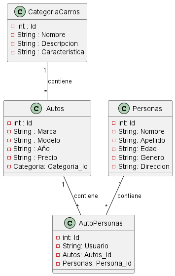

# Control de autos y sus categorias.

### Objetivo: Desarrollar un sistema de gestion que permita administrar la informacion dada con categorias de carros, para ello se debe tener el `id`, el `nombre`, una `descripcion` y una `caracteristica`. De los autos se debe saber la `marca`, el `modelo`, el `año`, `precio` y su `referencia a categoria`. Se debe saber tambien el `id` de cada persona, el `id`,`nombre`, `apellido`, `edad`, `genero` y su `direccion`. Esto con el objetivo de optimizar la gestion de informacion relacionada con el mundo automotriz desde la clasificacion de carros hasta el segumiento de las relaciones entre Autospersonas, con el fin de mejorar la eficiencia y productividad .


### Analisis: Definicion de requerimientos.

* CategoriaCarros{id, nombre, descripcion, caracteristicas}
* Autos{id,marca,modelo, año, precio, ref:Categoria}
* Personas{id, nombre, apellido, edad, genero, direccion}
* AutoPersonas{Id, usuario  ref: Autos, ref: Persona }

1. RF1:
* Realizar la CRUD de CategoriaCarros, dónde se requiere la siguiente estructura de la entidad: `Categoria{id,nombre,descripcion, caracteristicas}`
-El sistema debe validar los datos ingresados.
-El sistema muestra la lista de categorías de carros disponibles, incluyendo sus detalles como nombre, descripción y características.

2. RF2:
* Realizar la CRUD de Autos, dónde se requiere la siguiente estructura de la entidad: `Autos{id,marca,modelo, año, precio , ref:Categoria}`
-El usuario proporciona los datos necesarios para crear un nuevo auto, como la marca, modelo, año, precio y categoría a la que pertenece.
-El sistema debe validar los datos ingresados.

3. RF3:
* Realizar la CRUD de Personas, dónde se requiere la siguiente estructura de la entidad: `Personas{id,nombre, apellido, edad, genero, direccion,}`
-El usuario proporciona los datos necesarios para crear una nueva persona, como el nombre, apellido, edad, género y dirección.

4. RF4:
* Realizar la CRUD de cliente, dónde se requiere la siguiente estructura de la entidad: `AutoPersonas{Id,nombre, Ref: Autos, ref: Persona}`


### Diseñar Base de Datos

* `CategoriaCarros`

| Id | Nombre         |        Descripción                 |        Caracteristica                        | 
|----|----------------|------------------------------------|----------------------------------------------|
| 01 |Deportivo/Coupé |Gran rendimiento y estilo llamativo |Asientos mas bajos, diseño aerodinámico       |     
| 02 |Sedán           |Vehiculo de 4 puertas               |Espacio amplio, eficiencia de combustible     | 
| 03 |Hatchback       |Tienen una área de carga trasera    |Diseño compacto y maniobrable                 | 

* `Autos`

| Id |Marca  | Modelo    | Año   |Precio       | CategoriaId|
|----|-------|-----------|-------|-------------|------------|
| 01 |Toyota |Corolla    |2022   |$200'000.000 |     1      |
| 02 |Ford   |Mustang    |2022   |$300'000.000 |     2      |
| 03 |Tesla  |Model 3    |2023   |$400'000.000 |     3      |

* `Personas`

| Id |Nombre          | Apellido | Edad |Genero     | Direccion              |
|----|----------------|----------|------|-----------|------------------------|
| 01 |Maria Paula     |Castro    |25    |Femenino   |Calle 14 Neiva          |
| 02 |Santiago Andres |Fernandez |34    |Masculino  |Calle 7- Floresta       |
| 03 |Laura Sofia     |Garcia    |19    |Femenino   |Calle 5- Barrios unidos |

* `AutoPersonas`

| Id | Usuario  |  AutosId | PersonasId | 
|----|----------|----------|------------|
| 01 |Usuario01 |     01   |  03        |
| 02 |Usuario02 |     03   |  01        |
| 03 |Usuario03 |     02   |  02        |

> Ver



> Script de la base de datos
```sql

    DROP DATABASE IF EXISTS ControldeAutos;

    CREATE DATABASE ControldeAutos;

    USE ControldeAutos;

    CREATE table CategoriaCarros(
        Id INT NOT NULL PRIMARY KEY AUTO_INCREMENT,
        Nombre VARCHAR(50) NOT NULL,
        Descripcion VARCHAR(50) NOT NULL,
        Caracteristicas VARCHAR(50) NOT NULL,
        
    ); 

    CREATE table Autos(
        Id INT NOT NULL PRIMARY KEY AUTO_INCREMENT,
        Marca VARCHAR(50) NOT NULL,
        Modelo VARCHAR(50) NOT NULL ,
        Año DATE NOT NULL,
        Precio Float NOT NULL,
        Categoria_Id INT NOT NULL,
        FOREIGN KEY (Categotia_Id) REFERENCES Categoria(Id)
    ); 

    CREATE table Personas(
        Id INT NOT NULL PRIMARY KEY AUTO_INCREMENT,
        Nombre VARCHAR(50) NOT NULL,
        Apellido VARCHAR(50) NOT NULL ,
        Edad DATE NOT NULL,
        Genero VARCHAR(50) NOT NULL,
        Direccion Float NOT NULL,
    );

    CREATE table AutoPersonas(
        Id INT NOT NULL PRIMARY KEY AUTO_INCREMENT,
        Usuario VARCHAR(50) NOT NULL,
        AutosId INT NOT NULL,
        Personas_Id INT NOT NULL,
        FOREIGN KEY (Autos_Id) REFERENCES Autos(Id)
        FOREIGN KEY (Personas_Id) REFERENCES Personas(Id)
    );    

```
# Ver planificación 
[Ver Aquí](https://trello.com/b/PXKpq815/parcial2)


}

 


